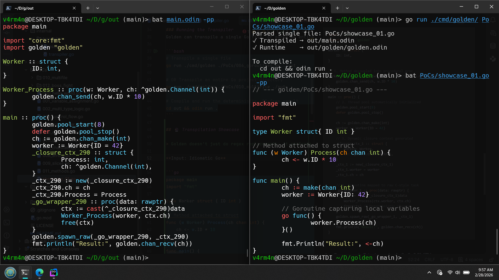

#  Golden

<p align="center">
  
</p>

<p style="font-size: 20px;">
  <strong>Authentic Go syntax, zero garbage collection.</strong>
  A high-performance transpiler targeting Odin with ARC for deterministic, systems-level power.
</p>

## 🎯 Vision

The systems programming world is currently split. On one side, you have Rust: undeniably powerful, but heavily bogged down by steep learning curves, slow compile times, and constant cognitive friction with the borrow checker. On the other side, you have Go: an absolute joy to write with a massive ecosystem, but disqualified from true real-time, high-performance, or game-engine domains due to the unpredictable latency of its Garbage Collector. 

**Golden is my ambition to merge these two worlds.** It bridges the gap between a ubiquitous, high-level language and a niche, brutally fast systems compiler. By taking Go's clean syntax and mapping it directly to Odin's low-level metal—swapping out the GC for deterministic ARC and Arena allocators—Golden gives you the developer experience and ecosystem of Go, backed by the uncompromising, hard-mode power of Odin.

## 📁 Project Structure

```text
golden/
├── cmd/golden/         # The CLI entry point (The "Brain")
├── internal/transpiler/# AST traversal and Odin code generation logic
├── runtime/            # ARC, Arena, and Task Pool library (golden.odin)
├── PoCs/               # Proof of Concepts & Regression Test Suite
└── go.mod              # Go module definition
```

## 🚀 Getting Started
### Prerequisites
- [Go](https://go.dev/doc/install) (to run the transpiler)
- [Odin](https://odin-lang.org/docs/install/) (to compile the generated output)

### Running the Transpiler
Golden can transpile a single Go file, or parse an entire package directory, merge the ASTs, and output a unified Odin executable.

```bash
# Transpile a single file
go run ./cmd/golden ./PoCs/006_goroutines.go ./out

# OR Transpile an entire Go project directory
go run ./cmd/golden ./PoCs/010_multifile ./out

# Compile and run the deterministic, GC-free result
cd out && odin run .
```

## 🔮 Transpilation Showcase

> Golden doesn't just do regex replacements; it performs deep Abstract Syntax Tree (AST) analysis. It decouples Object-Oriented methods, maps CSP concurrency to thread-pools, and dynamically packs closure variables into heap-allocated structs to prevent memory violations.

**Input: Idiomatic Go**

```go
package main
import "fmt"

type Worker struct { ID int }

// Method attached to struct
func (w Worker) Process(ch chan int) {
    ch <- w.ID * 10
}

func main() {
    ch := make(chan int)
    worker := Worker{ID: 42}

    // Goroutine capturing local variables
    go func() {
        worker.Process(ch)
    }()

    fmt.Println("Result:", <-ch)
}
```

Output: High-Performance Odin (Generated by Golden)

```odin
package main

import "core:fmt"
import golden "golden"

Worker :: struct {
    ID: int,
}

// 1. Method decoupled into procedural proc
Worker_Process :: proc(w: Worker, ch: ^golden.Channel(int)) {
    golden.chan_send(ch, w.ID * 10)
}

main :: proc() {
    // 2. Thread pool automatically initialized
    golden.pool_start(8)
    defer golden.pool_stop()

    ch := golden.chan_make(int)
    worker := Worker{ID = 42}

    // 3. Dynamic closure context generated
    _closure_ctx_1 :: struct {
        worker: Worker,
        ch: ^golden.Channel(int),
    }
    _ctx_1 := new(_closure_ctx_1)
    _ctx_1.worker = worker
    _ctx_1.ch = ch

    // 4. Goroutine mapped to raw C-style task
    _go_wrapper_1 :: proc(data: rawptr) {
        ctx := cast(^_closure_ctx_1)data
        Worker_Process(ctx.worker, ctx.ch)
        free(ctx) // Deterministic cleanup
    }
    golden.spawn_raw(_go_wrapper_1, _ctx_1)

    fmt.println("Result:", golden.chan_recv(ch))
}
```



## 🛠 Current Status (v1.0.0 MVP)

### Phase 1: Translator

[x] Authentic Go AST parsing

[x] Struct and dynamic Type mapping (int, string, bool -> b8, etc.)

[x] Control Flow (if/else, for loops, range)

### Phase 2: The Alchemist (Memory)

[x] Automatic Reference Counting (ARC) for escaping pointers

[x] Arena Frame Allocators for local-scoped structs

[x] Escape Analysis (Dynamically routes to ARC or Arena)

[x] Auto-injected defer statements for deterministic GC-free cleanup

### Phase 3: Engine (Concurrency)

[x] Custom Odin Work-Stealing Scheduler (Task Pool)

[x] Goroutines (go func()) mapped to thread-pool tasks

[x] Dynamic Closure Capture (AST Walker auto-packs local variables into structs)

[x] WaitGroups (sync.WaitGroup -> golden.WaitGroup)

### Phase 4: Language Semantics

[x] Slices ([]T mapped to [dynamic]T with auto-injected defer delete())

[x] Struct Methods (func (s *Struct)) decoupled into strict procedural calls

[x] Multi-file project compilation (Package-level AST merging)

[x] Idiomatic Error Handling (error interface mapped to nil-able C-Strings)

[x] Channels (chan) mapping to Mutex/Cond rendezvous thread synchronization

### Phase 5: The Road to V2.0

[ ] Maps (map[K]V) with automatic memory management

[ ] Interface (any / vtable) translation

[ ] select statements for complex channel topologies

[ ] Standard library bridging (os, io, net/http)